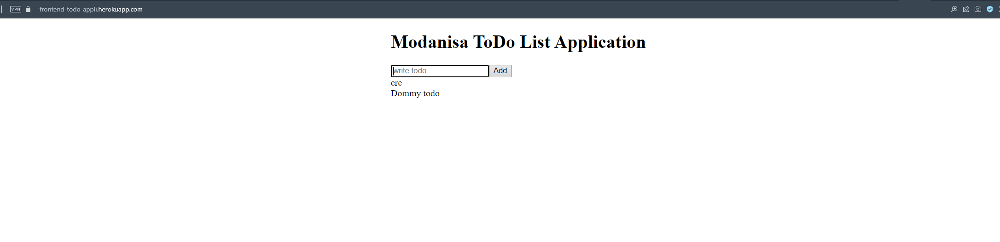
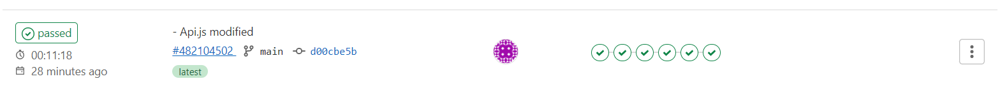
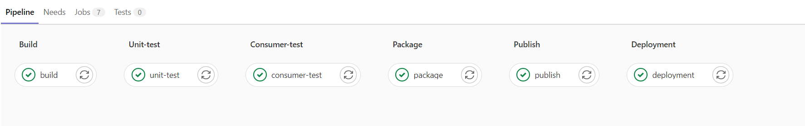

# ToDoList_Frontend

Frontend of the To Do List Application

## To Do List
- [x] 1- User interface for ONLY adding ToDo’s
- [x] 2- Back-end service to store a persistent state of ToDo list
- [x] 3- Writing deployment files of  front-end and back-end
- [x] 4- Automation buil-test-deployment via Gitlab CI/CD pipeline
- [x] 5- Dockerize
- [x] 6- Deploy application Heroku
- [x] 7- Write deployment configuration

## Test Stack For Front-End

<li> Vue (frontend) 
    <ol>
        <li>axios (Aapi calls)</li>
        <li>unit tests (vue-test-utils)</li>
        <li>consumer driven contract test (pact-foundation/pact/jest-pact)</li>
    </ol>
</li>

<li>Gitlab(CI_CD) .gitlab.ci.yml 
    <ol>
        <li>Build</li>
        <li>Unit Test</li>
        <li>Consumer Test</li>
        <li>Package</li>
        <li>Publish</li>
        <li>Deployment</li>
    </ol>
</li>
<li>Docker for prod and test env </li>
<li>Cloud Deployment</li>
 - Heroku

## Development Enviroment 

### Project Setup

To install packages first

``
yarn install
``

To run unit tests

``
yarn test:unit
``

To run pact tests

``
yarn test:pact
``
